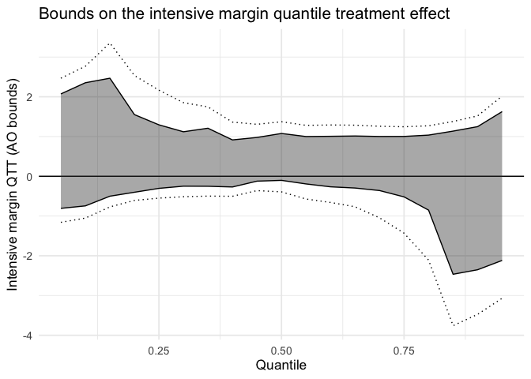

<!-- README.md is generated from README.Rmd. Please edit that file -->

# LeeDiD

<!-- badges: start -->

[](https://github.com/JavierViviens/claude-code-my-workflow/actions/workflows/R-CMD-check.yaml)
[](https://cran.r-project.org/)
<!-- badges: end -->

LeeDiD implements the identification and estimation strategy of Viviens
(2026), *“Estimating the Intensive Margin Effect in Panel Data
Settings,”* for recovering the **intensive margin treatment effect**
(e.g., the effect on those always observed, regardless of the treatment received) in panel data when
treatment is not randomly assigned.

The package adapts the Horowitz-Manski-Lee bounds to both the canonical Difference-in-Differences and the
Changes-in-Changes frameworks to partially identify the average and
quantile treatment effect on the treated among **“Always Observed”
(AO)** units — those who would be selected into the estimation sample
under either treatment arm. Unlike the original Lee bounds,
identification here draws on **multiple sources of sample selection
jointly** (e.g., employment status *and* survey attrition), which
relaxes the monotonicity assumption needed for a single-source selection
correction.

## Installation

LeeDiD is not yet on CRAN. Install the development version from GitHub
with:

``` r
# install.packages("devtools")
devtools::install_github("JavierViviens/LeeDiD")
```

## Example

``` r
library(LeeDiD)

data(leedid_sim)

fit <- leedid(
  data           = leedid_sim,
  yname          = "y",
  tname          = "time",
  idname         = "id",
  gname          = "group",
  selection_vars = c("employed", "responded"),
  t              = 2,
  tmin1          = 1,
  boot           = TRUE,
  biters         = 199,
  seed           = 1
)
#> Bootstrap: 20 / 199 replications done
#> Bootstrap: 40 / 199 replications done
#> Bootstrap: 60 / 199 replications done
#> Bootstrap: 80 / 199 replications done
#> Bootstrap: 100 / 199 replications done
#> Bootstrap: 120 / 199 replications done
#> Bootstrap: 140 / 199 replications done
#> Bootstrap: 160 / 199 replications done
#> Bootstrap: 180 / 199 replications done

fit
#> LeeDiD: Intensive Margin Treatment Effect (Always-Observed units)
#> AO shares: pi_0 = 0.849, pi_1 = 0.928
#> N (post-period): control = 252, treated = 236
#> 
#> CiC ATT (unconditional): 0.39
#> AO ATT bounds:           [-0.693, 1.322]
#>   bootstrap SE:          0.049
#>   95% CI:               [-1.093, 1.658]
#> Classical DiD estimate:  0.38 [0.143, 0.624] (AO bounds)
```

``` r
plot(fit)
```



## Learn more

See `vignette("intro-to-leedid")` for a full walkthrough of the method
and the package’s API.
